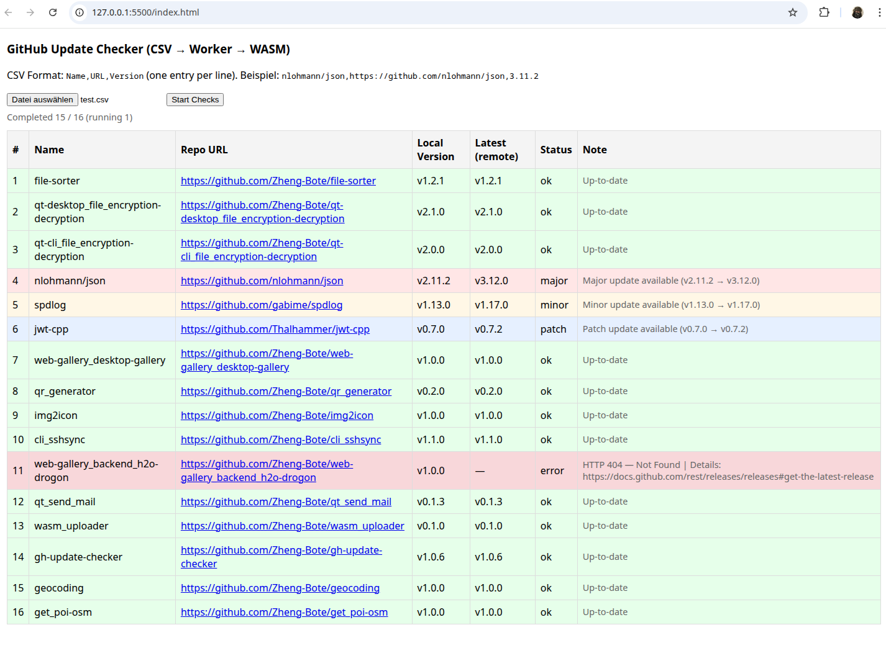

<div id="top" align="center">
  <h1>GitHub Update Checker (Web WASM)</h1>

  <p>browser‑based tool that checks GitHub repositories for the latest release and compares it with local versions supplied in a CSV file.</p>
  
[](https://opensource.org/licenses/MIT)
[]()

[](https://github.com/Zheng-Bote/wasm_gh-update_checker/releases)

[Report Issue](https://github.com/Zheng-Bote/wasm_gh-update_checker/issues) · [Request Feature](https://github.com/Zheng-Bote/wasm_gh-update_checker/pulls)

</div>

---

<!-- START doctoc generated TOC please keep comment here to allow auto update -->
<!-- DON'T EDIT THIS SECTION, INSTEAD RE-RUN doctoc TO UPDATE -->

**Table of Contents**

- [Features](#features)
- [Screenshots](#screenshots)
- [Quick Start](#quick-start)
  - [Prerequisites](#prerequisites)
  - [Files](#files)
  - [Build WASM with Emscripten](#build-wasm-with-emscripten)
- [Usage](#usage)
- [CSV Format](#csv-format)
- [Error Handling and Rate Limits](#error-handling-and-rate-limits)
- [Extending and Customizing](#extending-and-customizing)
- [📝 License](#-license)
- [Author](#author)
  - [Code Contributors](#code-contributors)

<!-- END doctoc generated TOC please keep comment here to allow auto update -->

---

**GitHub Update Checker WASM Worker** is a small, browser‑based tool that checks GitHub repositories for the latest release and compares it with local versions supplied in a CSV file. The heavy lifting runs in a Dedicated Web Worker; semantic version comparison runs in a compact WebAssembly module compiled from C++.

---

## Features

- **CSV input** with rows `Name,URL,Version`.
- **Dedicated Web Worker** performs HTTP requests using `fetch()` and limits concurrent requests.
- **WASM SemVer comparator** compiled from C++ for robust semantic version parsing and comparison.
- **Asynchronous, incremental UI updates**: each row is updated as soon as its result arrives.
- **Color coded results**: green = up to date, yellow = minor update, red = major update, red (error) = request or parse error.
- **Human friendly error messages** for HTTP and API errors.

## Screenshots



---

## Quick Start

### Prerequisites

- A static web server to serve files (WASM must be served over HTTP(S)).
- Emscripten SDK to build the WASM module if you want to recompile the C++ comparator.

### Files

- `index.html` Main UI.
- `main.js` UI logic and CSV parsing.
- `worker.js` Dedicated Web Worker that performs `fetch()` calls and calls into WASM.
- `ghupdate.js` and `ghupdate.wasm` Emscripten output exposing `compare_versions`.
- `check_gh_update.cpp` C++ SemVer comparator (optional source).

### Build WASM with Emscripten

Example compile command to produce `ghupdate.js` and `ghupdate.wasm`:

```bash
emcc check_gh_update.cpp \
  -std=c++23 -O3 \
  -sEXPORTED_FUNCTIONS='["_compare_versions"]' \
  -sEXPORTED_RUNTIME_METHODS='["cwrap"]' \
  -sALLOW_MEMORY_GROWTH=1 \
  -sFETCH=1 \
  -o ghupdate.js
```

Place ghupdate.js and ghupdate.wasm next to worker.js on your web server.

## Usage

1. Open the page index.html served from your web server.
2. Upload a CSV file with rows in the format:

```csv
Name,https://github.com/owner/repo,1.2.3
```

or

```csv
https://github.com/owner/repo,1.2.3
```

3. Click Start Checks. The worker enqueues jobs and runs up to 60 concurrent fetch() requests.
4. Each table row updates immediately when its result arrives. Errors are shown in the Note column with a readable message.

## CSV Format

Required columns: Name (optional), URL, Version.

Examples:

```csv
nlohmann/json,https://github.com/nlohmann/json,3.11.2
https://github.com/fmtlib/fmt,10.0.0
```

## Error Handling and Rate Limits

The worker formats HTTP error responses into concise, readable messages. Example:

```csv
HTTP 404 Not Found — Not Found | Details: https://docs.github.com/...
```

**Important**: GitHub unauthenticated API rate limits are low. For production or bulk checks, run a small server proxy that holds a GitHub token and forwards requests. Do not embed tokens in client code.

## Extending and Customizing

- Change concurrency: edit MAX_CONC in worker.js.
- Improve diff granularity: extend the C++ comparator to return structured diff details (major/minor/patch).
- Add authentication: implement a server proxy to attach a token for higher rate limits.

---

## 📝 License

This project is licensed under the MIT License - see the LICENSE file for details.

Copyright (c) 2026 ZHENG Robert.

## Author

[](https://www.github.com/Zheng-Bote)

### Code Contributors


---

<p align="right">(<a href="#top">back to top</a>)</p>
**Happy coding! 🚀** :vulcan_salute:
